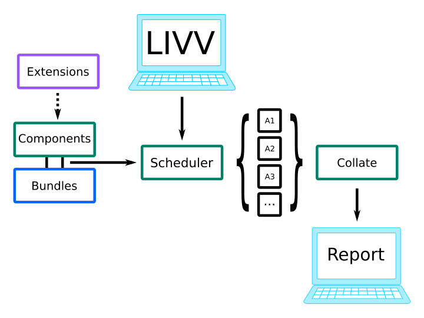

Design Overview
###############

As detailed in [Kennedy2017]_, LIVVkit is intended to be a comprehensive V&V toolkit for regular and
automated testing -- that is, testing models as they develop. It is designed to be *used* by model
developers/users to build their confidence in the model. Additionally, it is expected that the
testing output will be *viewed* and examined by a wider audience in order to enhance the credibility
of the model. 

Therefore, LIVVkit strives to meet these core **usage requirements**:

**Usable**
  LIVVkit should be easy to start using with no new technical skills needed (for a typical ice sheet
  modeler/developer). 

**Portable**
  LIVVkit should work where the models are developed; from laptops to HPCs. 

**Flexible**
  LIVVkit should accommodate multiple use cases and integrate into developers' workflow patterns.

**Extensible**
  LIVVkit should be able to accommodate new models, tests, and methods of analysis easily to keep
  pace with future developments.

**Nimble**
  LIVVkit should be able to perform the desired sets of analyses with minimal overhead and time to
  results.

Similarly, LIVVkit strives to meet these core **reporting requirements**:

**Informative**
  Analysis results should be described in a quantified manner, using appropriate metrics that
  indicate the degree of certainty, *and* provide the necessary context to make the figures, metrics
  and other results understandable.

**Shareable**
  Results should be easy to share, publish, and examine using common tools.

If you find LIVVkit isn't working for you, meeting these requirements, or have other suggestions for
improvement, please let us know by `opening an issue on github
<https://github.com/livvkit/livvkit/issues>`__.

Architecture
============

    Schematic of LIVVkit’s architecture and program flow [Kennedy2017]_. The light blue computers indicate where the
    user will interact with LIVVkit, first using the ``livv`` interface and then finally viewing the analyses report,
    typically as a portable website. The green boxes indicate core LIVVkit functionality, the black boxes are the
    different analyses which are executed in parallel, and the blue and purple boxes represent the ice-sheet model
    description bundles and any extensions analyses that may have been requested, respectively. Programmatically, the
    livv interface is used to schedule a series of analyses; the scheduler then pulls the requested analysis codes from
    the required bundles, components, and extensions; and executes the analyses. As each analysis finishes, some
    high-level summary information will be displayed on the command line through the interface and fully detailed
    information will be collated into the report. Once all analyses are finished, the interface will inform the
    user and the results of all the analyses can be viewed.

Components
----------

The major components of LIVVkit are: 

``livv``
  The LIVVkit command-line interface where users will primarily interact with LIVVkit, and request
  the desired V&V analyses. 

:py:mod:`livvkit.scheduler`
  The scheduler will then launch all of the V&V analyses in parallel and will collate the output
  when done.

:py:mod:`livvkit.components`
  A package containing the 
  :py:mod:`~livvkit.components.numerics`,
  :py:mod:`~livvkit.components.verification`,
  :py:mod:`~livvkit.components.performance`, and 
  :py:mod:`~livvkit.components.validation` components, which control the different types of
  verification and validation analyses (see the :doc:`vv-intro`). 
  
:py:mod:`livvkit.bundles`
  A package containing any model specific code bundles, which are used to completely encapsulate a
  particular ice sheet model's unique behavior. At its core, a bundle is simply a set of
  configuration files and Python modules. The configuration files describe paths, variable names,
  and the types of analysis available to LIVVkit, and the Python modules provide the methods to
  handle ice sheet model specific behavior (e.g., parsing input/log files and reshaping data
  sets).

**Utilities**
  All the functionality that falls outside the V&V paradigm is contained in:

  - :py:mod:`livvkit.elements`: LIVVkit element classes used to place figure/table/etc. elements into
    the report.

  - :py:mod:`livvkit.util`: utility classes and functions for dealing with general LIVVkit data
    manipulations, general I/O, etc.

  - :py:mod:`livvkit.resources`: HTML, CSS, Javascript, and image resources for generating the
    output website.

  - :py:mod:`livvkit.data`: static data used by different built in V&V analyses, and allows users to
    link in directories containing data for custom extensions. 
  

See :doc:`api` and/or :ref:`modindex` for a detailed list and description of LIVVkit's components.

