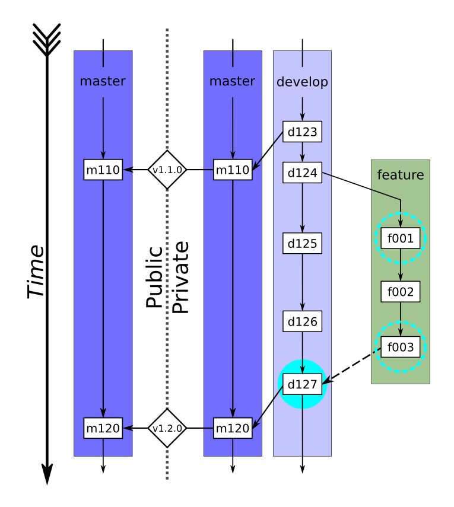

.. figure:: _static/livvkit.png
    :width: 400px
    :align: center
    :alt: LIVVkit

Usage
#####

LIVVkit is intended to be integrated into a model's development cycle. A public-private version of
`GitFlow <https://www.atlassian.com/git/tutorials/comparing-workflows#gitflow-workflow>`__ is a
common development cycle used by many scientific modeling groups. LIVVkit would be integrated
into this development process like:

    Schematic of the public-private development cycle used by many scientific modeling groups
    [Kennedy2017]_. A feature branch is created (``d124``, green path) from the current development
    branch (light purple path) and incremental changes are made (``f001``--``f003``). These changes
    frequently undergo the standard set of LIVVkit verification tests (dashed cyan circles). Once
    the feature is complete and tested (``f003``), it is ready to be merged into develop (which
    includes the new features ``d125``--``d126``) and a pull request will be opened by the developer
    (dashed arrow).  At this point, the integrators merge the feature into a local copy of the
    development branch and the full set of LIVVkit integration tests are started (filled cyan
    circle). Once passed, the feature is merged into develop (``d127``) and the pull request is
    closed. After enough features have been developed, the development branch will be merged into
    the private master branch (``m120``, right purple path), given a version tag (``v1.2.0``), and
    pushed to the mirrored master branch on the public repository (left purple path).

Standard verification and integration tests
===========================================

The standard verification and integration tests are performed by comparing a regression test
dataset, ``$TEST``, against a  reference dataset, ``$REF``. The datasets follows a somewhat rigid
leaf-node structure which allows the testing dataset to be more human-friendly than just a bunch of
files and still fully describe the tests. This directory structure is, for example, created by
CISM's Build and Test Structure (BATS).

.. _input-hierarchy:

Model Output/LIVVkit Input Hierarchy
------------------------------------

The directory layout of the model output should be as follows:

.. code-block:: bash

       BUNDLE
           ├── [METADATA]
           └── TEST
               ├── VARIANT
               │    ├── sRESO*
               │    │   ├── pPROC
               │    │   │   ├── [zSIZE*] 
               │    │   │   ├── ... 
               ...

where ``[]`` indicates an optional directory, ``BUNDLE`` indicate the specific ice-sheet model used
(including variant names; e.g., ``CISM_glissade``), ``METADATA`` indicates any directories that
contain information in addition to the testing data  (e.g., job submission scripts, CMakeCache.txt),
``TEST`` indicates a particular type of test (e.g., ``shelf``, ``dome``, ``ismip-hom``), ``VARIANT``
indicates any variant of that test (e.g., ``ismip-hom-a``), ``sRESO`` indicates the grid resolution,
``pPROC`` indicate the number of processors used to run the test, and ``zSIZE`` indicates the domain
size used in the test. 

.. note:: 

    The percise meaning of any ``*``-ed directory name may be variable from test to test, but
    will generally follow the definition given here. 

Standard verification  analysis
-------------------------------

The standard verification analysis typically compares a regression test dataset with a reference
dataset. Because these datasets can be quickly generated and analyzed (:math:`\Delta t \lesssim` a
coffee break), they can (and should) be run frequently. 

When a developer makes a new feature branch, they would first generate a reference dataset on their
development machine. 

For a CISM developer working on a Linux laptop/desktop, using the GNU compiler, and outputting the
datasets to a ``reg_ref`` directory, this would look like:

.. code-block:: bash

    cd $CISM
    git checkout -b feature-branch

    cd tests/regression/
    ./build_and_test.py -p linux-gnu -o reg_ref
    export REF=$PWD/reg_ref/linux-gnu/CISM_glissade

When a change is made to the model and the developer is ready to test their code, they
will then generate a test dataset on their development machine.

Again for a CISM developer working on a Linux laptop/desktop, using the GNU compiler, and outputting the
datasets to a ``reg_test`` directory, this would look like:

.. code-block:: bash

    # ... A change to CISM ...

    cd $CISM/tests/regression/
    ./build_and_test.py -p linux-gnu -o reg_test
    export TEST=$PWD/reg_test/linux-gnu/CISM_glissade

Then, the testing results can be compared to a reference dataset with LIVVkit: 

.. code-block:: bash
    
    cd $LIVV
    ./livv --verify $TEST $REF -o vv_test -s

LIVVkit will run the verification suite, report a summary of the results on the command line,
produce an output website in the created ``vv_test`` directory, and launch an HTTP server to easily
view the output website. LIVVkit will tell you the address to view the website at on the command
line, which will typically look like
`http://0.0.0.0:8000/vv_test/index.html <http://0.0.0.0:8000/vv_test/index.html>`_.

Once the feature is developed, and the developer is happy with the testing results, she/he would
push the feature branch to the development repository and open a pull request, kicking off a
integration analysis by the model integrator(s). Additionally, the output directory may
compressed and uploaded to Github for viewing by the integration team (every output website is
portable). 

Integration analysis
--------------------

Upon receiving a pull request for a new feature, a model's integration team will typically initiate
a more substantial test of the new feature, often on the target production machine(s). 

First, the integrator would checkout the code base on the production machine, and generate a
reference dataset for the current state of the development branch:

For a CISM integrator working on the supercomputer Titan at `OLCF <https://www.olcf.ornl.gov/>`__,
using the GNU compiler, and outputting the datasets to a ``reg_ref`` directory, this would look
like:

.. code-block:: bash

    cd $CISM
    git checkout develop

    cd tests/regression/
    ./build_and_test.py -b ref_build -p titan-gnu --timing -o reg_ref
    export REF=$PWD/reg_ref/linux-gnu/CISM_glissade

    cd reg_ref/titan-gnu/CISM_glissade
    ./submit-all-jobs.bash

.. note::

    For CISM, BATS recognizes a set of platforms that requires job submission scripts,
    automatically sets up the jobs, and creates a submission script. Also, by specifying the
    ``--timing`` option, a much larger set of tests are run, including repeat runs for performance
    variability. 

Once those jobs are submitted, the integrator can attempt to merge in the feature branch. After all
conflicts are resolved, a test dataset would be generated.

Again, for a CISM integrator working on the supercomputer Titan at `OLCF
<https://www.olcf.ornl.gov/>`__, using the GNU compiler, and outputting the datasets to a
``reg_test`` directory, this would look like:

.. code-block:: bash

    cd $CISM
    git merge feature-branch

    # ... resolve any conflicts ...

    cd $CISM/tests/regression
    ./build_and_test.py -b test_build -p titan-gnu --timing -o reg_test
    export TEST=$PWD/reg_test/linux-gnu/CISM_glissade

    cd reg_test/titan-gnu/CISM_glissade
    ./submit-all-jobs.bash

Then once all the jobs were finished, the testing results can be compared to a reference dataset. 

.. code-block:: bash
    
    cd $LIVV
        ./livv --verify $TEST $REF -o vv_test -s

LIVVkit will run the verification suite, report a summary of the results on the command line,
produce an output website in the created ``vv_test`` directory, and launch an HTTP server to easily
view the output website. LIVVkit will tell you the address to view the website at on the command
line, which will typically look like
`http://0.0.0.0:8000/vv_test/index.html <http://0.0.0.0:8000/vv_test/index.html>`_.

Additionally, the output directory may compressed and uploaded to Github for viewing by the rest of
the integration team and the feature developer (every output website is portable). If test results
aren't satisfactory, this provides a valuable resource for the developer to make the necessary
changes to their feature. 

Once testing results are satisfactory, the integration team may do a similar comparison to the
latest release in order to track changes over a longer period of development and analyze the model
for creep, or run a series of extended validation analyses. 

Extended and/or validation analyses
===================================

.. note::
    
    A set of standard ice sheet model validation analyses are currently being developed and will be
    released soon (along with the necessary observational data). Currently, there is a preliminary set
    of validation analyses developed for E3SM (`Energy Exascale Earth System Model <https://e3sm.org/>`_),
    CESM (`Community Earth System Model <http://www.cesm.ucar.edu/>`_), and CISM
    (`Community Ice Sheet Model <https://cism.github.io/>`_), which are contained in the `LIVVkit
    Extensions (LEX) repository <https://code.ornl.gov/LIVVkit/lex>`_. See the :doc:`lex` page for how to
    get and use LEX as well as how develop your own validation analysis.

